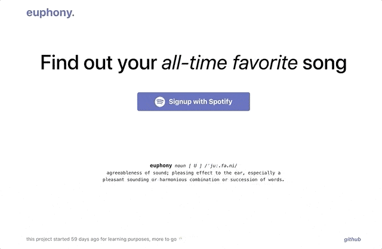

# Euphony

I decided to make a little side project in my free time to try some technologies that I want to learn. 

Here comes the Euphony.

https://euphony.me

**Technologies used;**
- React with Redux
- Node.js with Express
- Spotify OAuth for authentication
- Docker for containerization
- AWS Elastic Beanstalk
- MongoDB for database with Mongoose
- GraphQL for API connection



---

### euphony 
noun [ U ] /ˈjuː.fə.ni/

```
agreeableness of sound; pleasing effect to the ear, 
especially a pleasant sounding or harmonious combination or succession of words.
```
